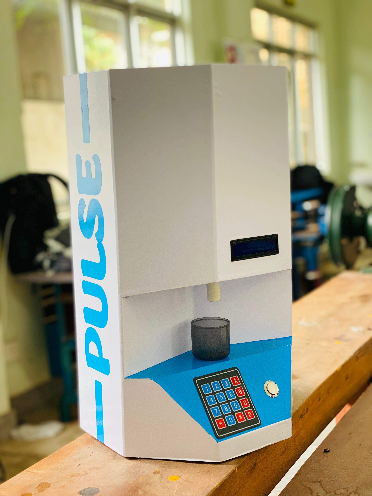
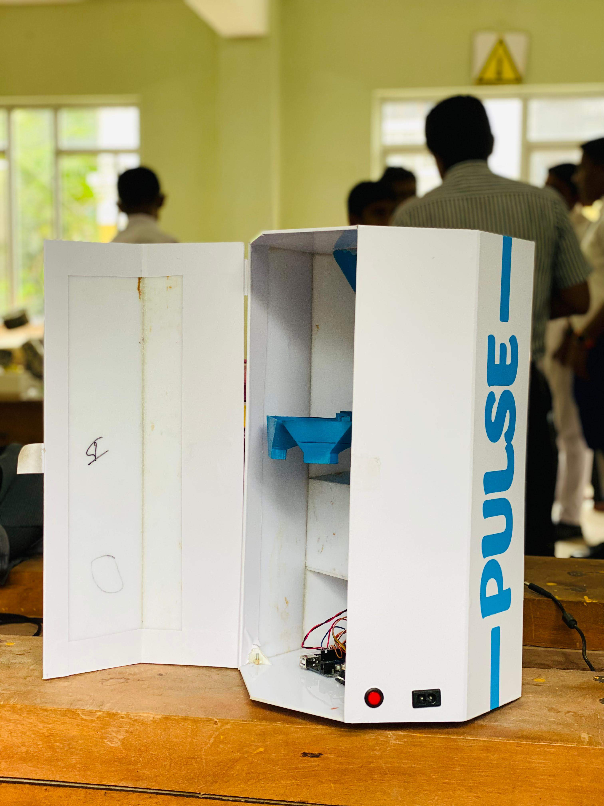
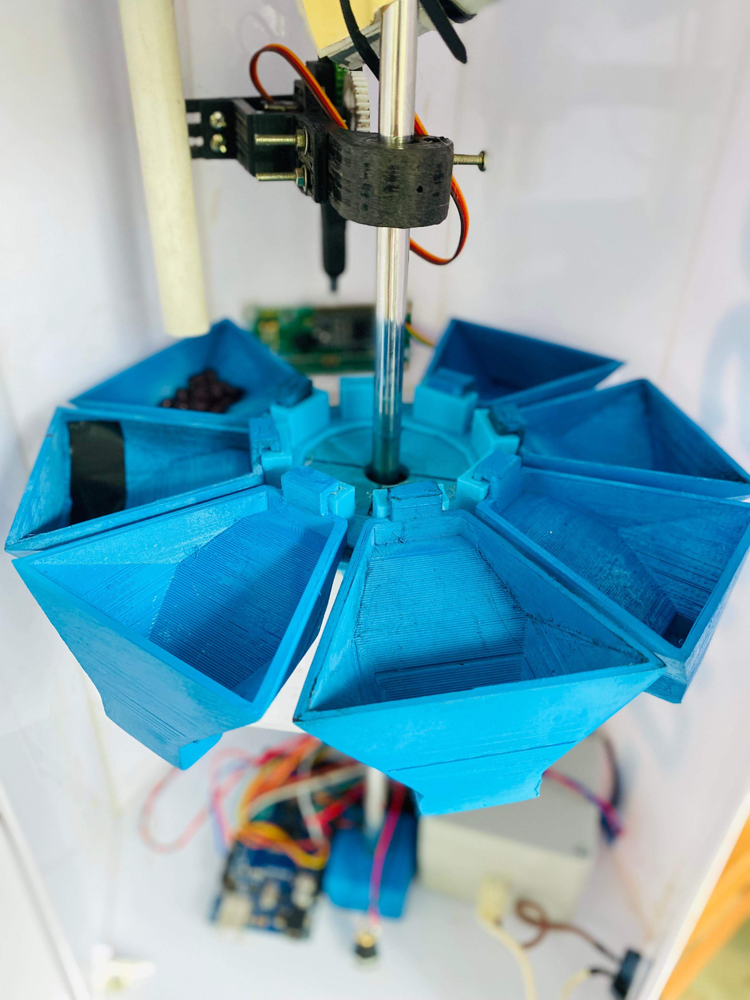
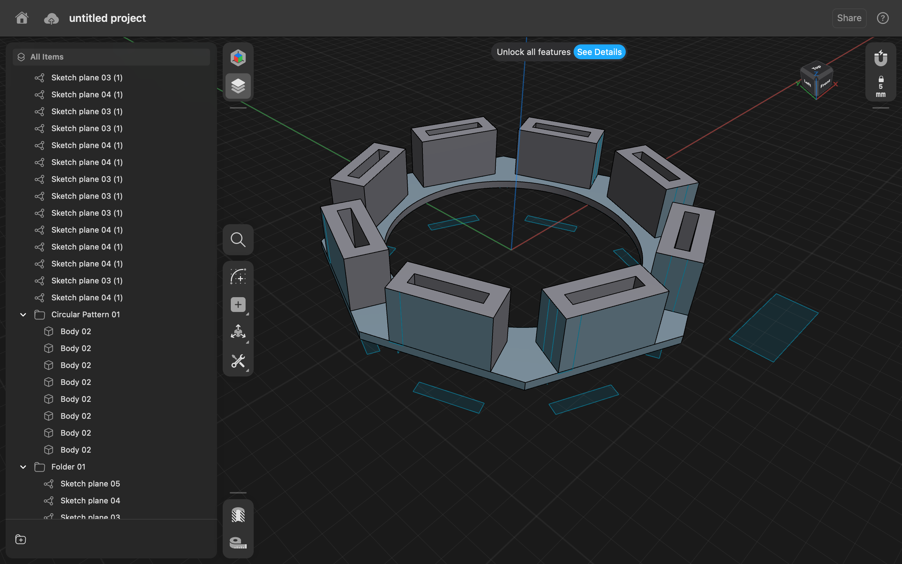
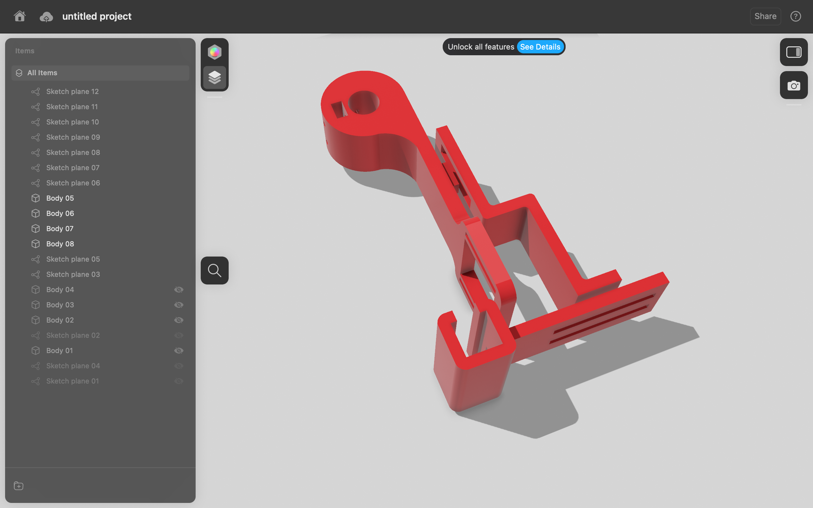

# 💊 PULSE — Smart Pill Dispenser

  <strong>Award-winning IoT medication management system designed to help elderly users take the correct medication at scheduled times.</strong>

  🏆 <b>1st Place — National All-Island Innovation Competition (2024)</b>

  

---

## 📌 Overview

**PULSE** is an automated smart pill dispenser developed in **2023** to support elderly users with medication management. The system combines scheduled reminders with accurate automated pill dispensing to help reduce missed doses.

The project integrates embedded electronics, IoT connectivity, mechanical design, 3D-printed components, and a custom web platform into a single working prototype.

## ✨ Key Features

- ⏰ Scheduled medication reminders
- 💊 Automated pill dispensing
- 🔄 Motorised multi-compartment carousel
- 🖥️ LCD user interface
- ⌨️ Keypad control
- 🌐 Custom web platform
- 📡 ESP8266-based IoT connectivity
- 🧩 Custom CAD-designed and 3D-printed mechanical components

## ⚙️ Hardware

| Component | Purpose |
| --- | --- |
| **ESP8266** | Main IoT-enabled controller |
| **NEMA 17 Stepper Motor** | Drives the pill carousel |
| **A4988** | Stepper motor driver |
| **Servo Motor** | Mechanical actuation |
| **LCD Display** | User information and system status |
| **Keypad** | Local user input |
| **Shucker Pump** | Part of the dispensing mechanism |

## 💻 Software

- **Arduino IDE** — embedded firmware development
- **Custom Web Platform** — remote/user-facing system interface
- **CAD Design** — mechanical parts and enclosure development

## 🛠️ Mechanical Design

The dispensing mechanism uses a **motorised carousel with multiple pill compartments**. Custom parts were designed in CAD and fabricated using **3D printing**, allowing the electronics and mechanical dispensing system to work as one integrated prototype.

## 🧠 Engineering Areas

`Embedded Systems` · `IoT` · `Mechatronics` · `CAD` · `3D Printing` · `Motor Control` · `Web Integration`

## 🏆 Achievement

**1st Place — National All-Island Innovation Competition (2024)**

PULSE was developed as a practical engineering solution for medication management, combining hardware, software, and mechanical design in a functional prototype.

## 📷 Project Gallery

### Completed Prototype

<table>
  <tr>
    <td width="50%" align="center">
       
      <strong>Completed PULSE Prototype</strong> Integrated enclosure, LCD, keypad and dispensing outlet.
    </td>
    <td width="50%" align="center">
       
      <strong>Internal Construction</strong> Rear access view showing the installed mechanical and electronic systems.
    </td>
  </tr>
</table>

### Dispensing Mechanism

   
  <strong>Motorised Carousel</strong> Multi-compartment dispensing mechanism with custom 3D-printed components.

### CAD Development

<table>
  <tr>
    <td width="50%" align="center">
       
      <strong>Carousel Concept</strong> High-level CAD view of the multi-compartment arrangement.
    </td>
    <td width="50%" align="center">
       
      <strong>Mechanical Development</strong> Visual design study for a custom mechanism component.
    </td>
  </tr>
</table>

> **Design protection:** Dimensioned drawings, editable CAD, STL files, manufacturing data, firmware source, and other production-ready materials are intentionally not published. This repository is a portfolio showcase, not an open-source hardware release.

---

## 👨‍💻 Developed by

**Theviru Lakwan**  
Mechatronics Engineer · PCB Designer · IoT Developer · Entrepreneur

[LinkedIn](https://linkedin.com/in/theviru-lakwan-7758a41b8) · [GitHub](https://github.com/MrTheviru)

---

### Intellectual Property

© 2023–2026 Theviru Lakwan. All rights reserved.

This repository is provided for portfolio and demonstration purposes. No permission is granted to copy, modify, manufacture, distribute, sublicense, or commercially use the project designs, documentation, or other original materials without prior written permission from the author.
